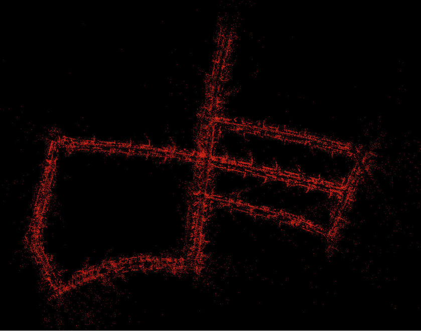

# StereoVision-SLAM

<p align="center">
  
</p>

<b>StereoVision-SLAM</b> is a real-time visual stereo SLAM (Simultaneous Localization and Mapping) written in Modern C++ tested on the KITTI dataset. This project is intentionally straightforward and thoroughly commented for educational purposes, consisting of four components: Frontend, Backend, Loop-Closure, and Visualizer.

- <b>Frontend</b>: it is based on extracting a small number of 2D keypoints and 3D landmarks. The keypoints are tracked to the new frame using optical flow, followed by solving a non-linear optimization to obtain the new frame pose using the tracked features and their corresponding 3D map points.

- <b>Backend</b>: based on solving Bundle Adjustment (BA) non-linear optimization with g2o framework among last N keyframes to improve the pose of frames and the location of landmarks obtained by the frontend.

- <b>Loop-Closure</b>: the system uses deep feature vectors extracted by MobileNet-V2 deep neural network to detect a potential loop between the current keyframe and previous keyframes. After evaluating several heuristics, such as the number of inliers from keypoint matching between current keyframe and candidate keyframe, it corrects the pose and position of active keyframes and landmarks if a loop is detected. Additionally, after completing SLAM on input, it conducts Pose Graph Optimization.

- <b>Visualizer</b>: interactive visualizer by leveraging Rerun that depicts the path, active keyframe poses, active landmarks (map points), logs of SLAM pipeline during execution, last keyframe left image, ratio of inliers in fronted, and the best deep feature similarity score for loop closure.

- <b>Dense 3D Reconstruction</b>: There is another component that is not part of StereoVision-SLAM; however, the output of StereoVision-SLAM can be fed into it to generate a colored dense 3D reconstruction of the input video. It utilizes the pose of keyframes in world coordinate system and the left and right images of these keyframes for stereo system depth estimation to create a dense map.

<p align="center">
  
</p>


## How to Use

### Dependencies
The program uses C++ 17 and depends of the following libraries and frameworks for matrix operation, Lie Group and Lie Algebra, geometric transformations, computer vision, point cloud processing, visualization and non-linear graph based optimization (The versions mentioned are the ones I have tested the project on, using Ubuntu 22):

- Eigen (3.4.0)
- Sophus
- Suitesparse/csparse (7.7.0)
- G2O (0.1)
- PCL (1.12)
- Rerun Viewer and Rerun (0.16.1)  [See reference 6]
- OpenCV (4.5.4)

### Data and Config Files
- Config files for the SLAM pipeline and 3D dense reconstructions are in the config folder. These config files contain input data locations, output path, hyper-parameters for the front end, back end, loop closure, visualization, etc. Each KITTI sequence has one config file and you can change hyperparameters to obtain better results.
- Download the KITTI odometry dataset[5], both gray and color images, and put it in the data folder. If you use another location, you should change the path of the input sequence in the config files. The default structure is as follows:

```
data
└── dataset
    └── sequences
        ├── 00
        │   ├── calib.txt
        │   ├── image_0
        │   ├── image_1
        │   ├── image_2
        │   ├── image_3
        │   └── times.txt
        ├── 01
        .
        .
        .
```

### Running The Program

- First, install the dependencies.
- Provide data as described above.
- Navigate to the root directory of the project.
- Enter `./build.sh` in the terminal to compile the project using cmake. The executables will be in the bin folder.
- Now run rerun-viewer [6] by entering `rerun` in the terminal. To later see outputs correctly I saved visualization setting of rerun-viewer in a file. It is suggested after opening rerun viewer from drop down menu select `open...` and load `rerun-io-rbl/rerun_stereo_vision_slam.rbl`.
- Execute the SLAM pipeline on one of the provided config files or your own config file like this:
```
 ./bin/run_stereo_visual_SLAM ./config/stereo_slam_configs/config-05.yaml 
``` 
- The SLAM output during execution will be displayed in the Rerun-Viewer, like the first gif.
- The SLAM output, including the pose of keyframes and sparse landmarks, will be written to the files `keyframes.txt` and `landmarks.pcd` in the output path specified in the config file. The 3D dense reconstruction uses `keyframes.txt`. If desired, you can use `pcl_viewer` to visualize `landmarks.pcd`.
<p align="center">
  
</p>

- To perform dense 3D reconstructions on the SLAM output of a sequence, create a config file similar to the provided ones and then enter a command like this in the terminal. The output is a `.pcd` file, similar to the second gif, which you can visualize with `pcl_viewer`:
```
./bin/run_dense_reconstruction config/dense_3D_reconstruction_configs/config-05.yaml
```

## Demo


## References
1- "Introduction to Visual SLAM From Theory to Practice" by  Xiang Gao and Tao Zhang, Springer Singapore, [[Link](https://link.springer.com/book/10.1007/978-981-16-4939-4)]

2- SLAMBOOK2 [[Link](https://github.com/gaoxiang12/slambook2/tree/master)][[Link](https://github.com/gaoxiang12/slambook2/tree/master/ch13)]

3- X. Zhang, Y. Su and X. Zhu, "Loop closure detection for visual SLAM systems using convolutional neural network," [[Link](https://ieeexplore.ieee.org/document/8082072)]

4- Pytorch Mobilenet V2 [[Link](https://pytorch.org/hub/pytorch_vision_mobilenet_v2/)]

5- KITTI Dataset [[Link](https://www.cvlibs.net/datasets/kitti/eval_odometry.php)]

6- Rerun [[Link](https://rerun.io/)][[Link](https://rerun.io/docs/getting-started/installing-viewer)][[Link](https://github.com/rerun-io/rerun)]